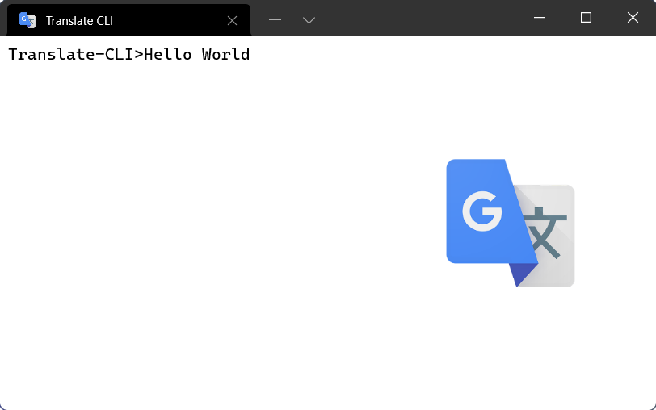

# Translate-CLI
CLI переводчик основанный на Google translate API

## скрипт использует библиотеки mtranslate и argparse, скомпилирован при помощи nuitka
pip3 install mtranslate argparse nuitka

## как пользоваться ?
1) запустить в консоли скомпилированный скрипт (exe - windows, bin - linux)
2) ввести текст который нужно перевести 
3) для выхода пропишите quit() или exit()

### флаги 
-h --help - справка
-l --language - язык на который выполняется перевод (default ru)
-t --text - быстрый перевод без оболочки